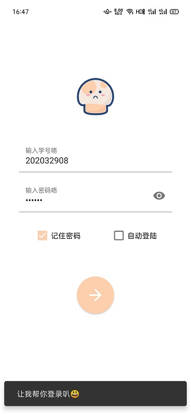
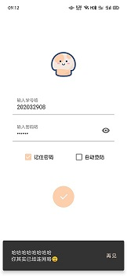
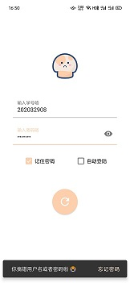

# 蘑菇助手

## 项目介绍

项目地址：https://github.com/lionche/CheNet

西北大学校园网（NWU-STUDENT）登录软件。浏览器登录的方式效率太低且体验不佳，通过网络抓包了解了登录的原理后，通过安卓OKHTTP来发送登录请求，达到相同的效果。

注意仅支持NWU-STUDENT，不支持NWUNET ! ! !

注意仅支持NWU-STUDENT，不支持NWUNET ! ! !

注意仅支持NWU-STUDENT，不支持NWUNET ! ! !


                                                         


## 构建

- Android Studio 4.1.1

- gradle-build-tool 4.1.1"

- gradle-wrapper-properties 6.5

  

## 学习交流

本项目仅供学习交流，且永久免费，承诺不会收集任何用户的个人信息，切勿用于任何非法途径。

如果你发现本项目有内容上的错误，欢迎提交 issues 进行指正。


## 特别感谢

特别感谢“大厂F5”，思雨，力文等同学在本软件的开发期间，帮助我进行测试，并提供了宝贵意见。


## 如果觉得项目还不错

本软件遵循MIT协议，欢迎fork后随意修改，如果它对你帮助很大，并且你很想支持软件的后续开发和维护，那么你可以扫下方二维码随意打赏我，就当是请我喝杯咖啡或是啤酒，我将不胜感激 :-)


​                                                                                                       

​                                  

## License

```
MIT License

Copyright (c) 2020 xiaokangche

Permission is hereby granted, free of charge, to any person obtaining a copy
of this software and associated documentation files (the "Software"), to deal
in the Software without restriction, including without limitation the rights
to use, copy, modify, merge, publish, distribute, sublicense, and/or sell
copies of the Software, and to permit persons to whom the Software is
furnished to do so, subject to the following conditions:

The above copyright notice and this permission notice shall be included in all
copies or substantial portions of the Software.

THE SOFTWARE IS PROVIDED "AS IS", WITHOUT WARRANTY OF ANY KIND, EXPRESS OR
IMPLIED, INCLUDING BUT NOT LIMITED TO THE WARRANTIES OF MERCHANTABILITY,
FITNESS FOR A PARTICULAR PURPOSE AND NONINFRINGEMENT. IN NO EVENT SHALL THE
AUTHORS OR COPYRIGHT HOLDERS BE LIABLE FOR ANY CLAIM, DAMAGES OR OTHER
LIABILITY, WHETHER IN AN ACTION OF CONTRACT, TORT OR OTHERWISE, ARISING FROM,
OUT OF OR IN CONNECTION WITH THE SOFTWARE OR THE USE OR OTHER DEALINGS IN THE
SOFTWARE.
```
